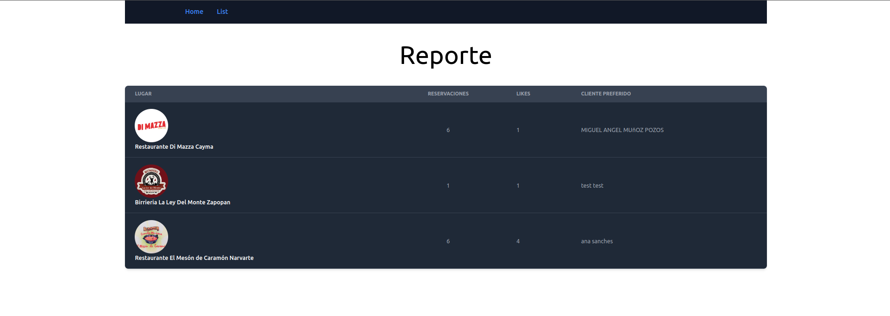
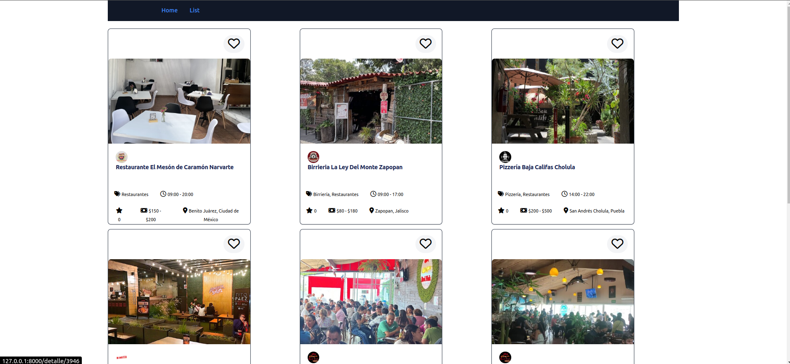
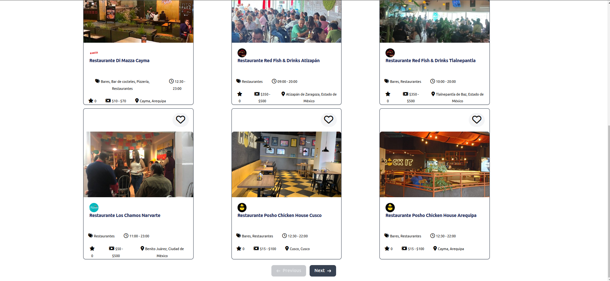
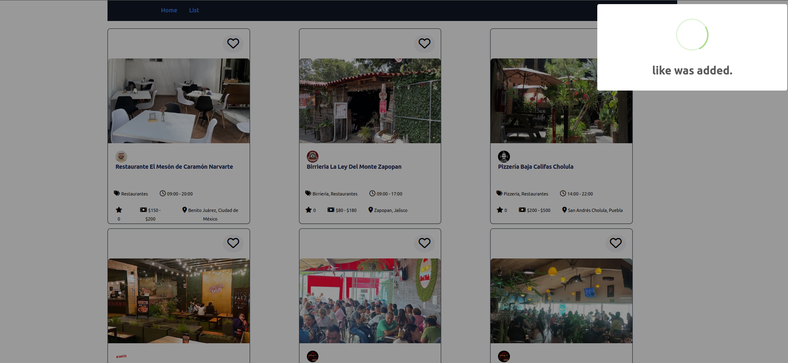
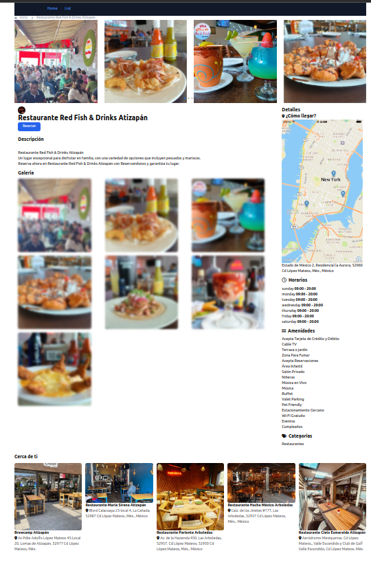
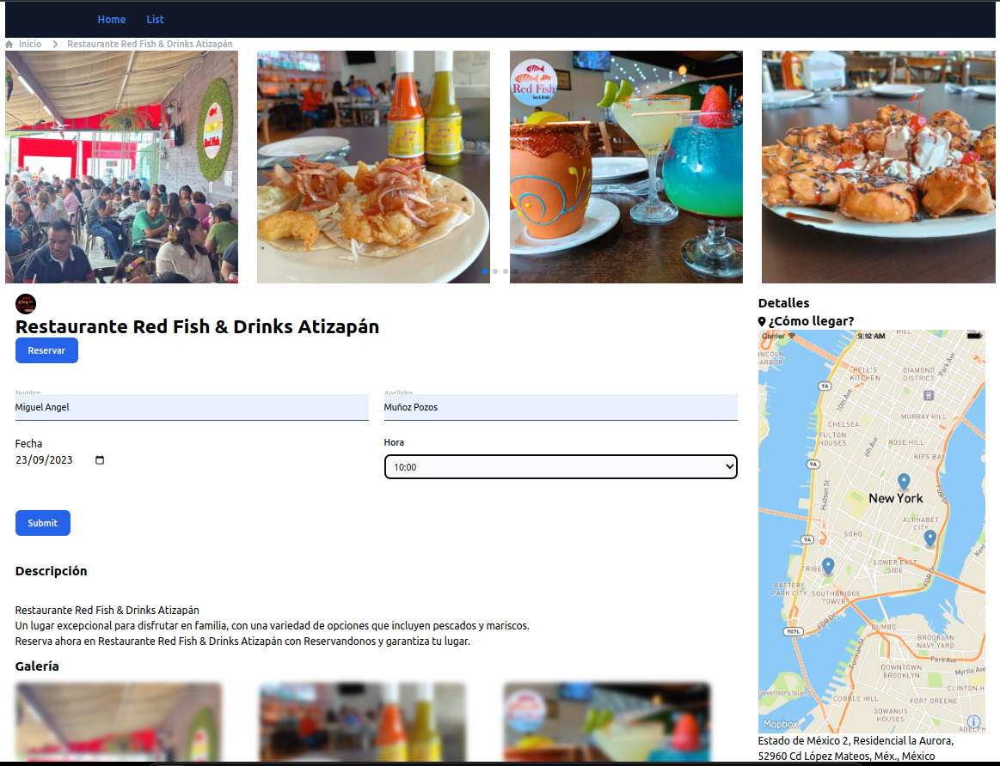
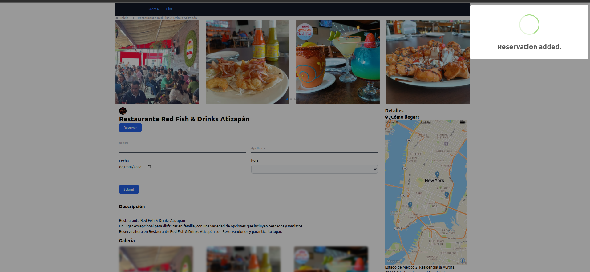
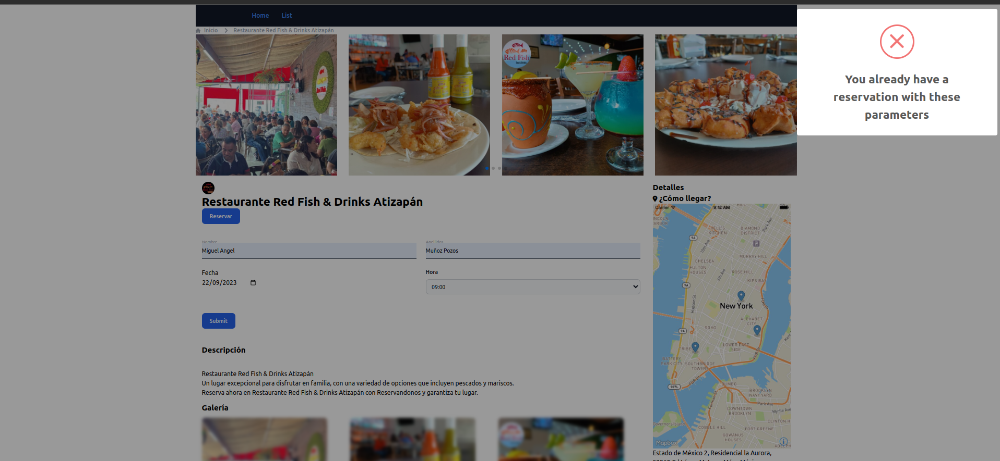

# reservandonos prueba tecnica

# Instalación y configuración en local

Pasos para iniciar el proyecto de forma local

## Clonar el repositorio

```bash
    git clonehttps://github.com/MiguelAngelMP10/reservandonos-prueba-tecnica
```

## Moverse a la carpeta del proyecto

```bash
   cd reservandonos-prueba-tecnica
```

## Instalación de dependecias de php y nodejs

```bash
composer install
```
```bash
npm i
```

## Configuraciones

Realizar copia del archivo .env.example

```text
    cp .env.example .env
```

Generar key de aplicación

```bash
  php artisan key:generate
```

## Configuración de bases de datos ya sea con _SQLite o MySql_

### SQLite

#### Crear archivo .sqlite

```bash
touch database/database.sqlite

```

### Configurar en archivo .env los siguientes valores

```env
    DB_CONNECTION=sqlite
    DB_DATABASE=/absolute/path/to/database.sqlite
```

### MySql

#### Crear base de datos en el motor de bases de datos

#### Configurar en archivo .env los siguientes valores

```env
    DB_CONNECTION=mysql
    DB_HOST=
    DB_PORT=
    DB_DATABASE=
    DB_USERNAME=
    DB_PASSWORD=
```

## Se ejecutan las migraciones para construir las tablas necesarias

```bash
php artisan migrate
```


## Arrancamos el proyecto con con artisan 

```bash
    php artisan serve
```
```bash
npm run dev
```

## Pasos para validar prueba

veremos la lista de lugares con mas reservaciones 


al dar clic en list se muestra un listado de los lugares dado el enport con el paginado

Para cambiara de pagina basta en dar clic en siguiente


Cuando se da click en el corazon se deja un like y se notifica 

Al entrar al detalle de algun lugara se myesra informacion general de un lugar

Al dar clic en Reser4vara se muestra un formulario para reservar


Al dara clic en submit se guarda información

